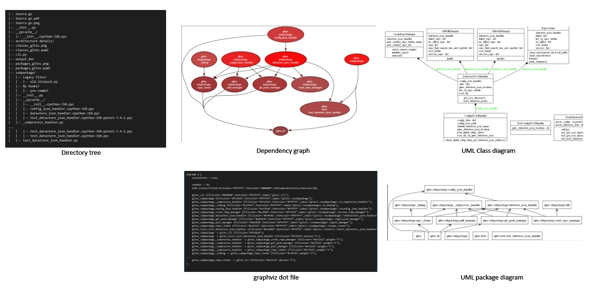

# software_engineering_toolbox

I am curating a software engineering toolbox that display as much as information from a package.

## 1. Package structure, Dependency, UML diagrams

Three kinds of diagrams:

- Dependency graphs
- UML Class diagrams
- UML Package diagrams

Three kinds of trees / intermediate representaions:

1. DepGraph JSON (from pydeps)
2. Plantmul script (from pylint)
3. Directory tree

[Demonstration](https://github.com/pakkinlau/software_engineering_toolbox/blob/main/1.%20Package%20structure%2C%20Dependency%2C%20UML%20diagrams/print_dependency_graph.ipynb): This folder contains the toolkits that users can generate various architectural diagrams for a package.

Display:

---

The following part is still under working: 

## 2. Static code analysis

- `flake8`: glues together with `pyflakes`, `pycodestyle` and `McCabe` for checkiong style and quality of python code
- `mypy`: Ensuring the type annotations are correct
- bandit`: find common security issues in python code

## 3. Testing and coverage

- `pytest`: A powerful tool for writing and running tests in Python, with a huge ecosystem of plugins.
- `[coverage.py](http://coverage.py/)`: Measuring code coverage of python programs
- `tox`: checking your package installs correctly with different Python versions and interpreters; running your tests in each of the environments, configuring your test tool of choice

## 4. Documentation

- `Sphinx`: A tool that makes it easy to create intelligent and beautiful documentation for Python projects.
- `Doxygen`: A tool for writing software reference documentation. The documentation is written within code.

## 5. Performance profiling

- `cProfile`: A built-in Python tool for profiling applications to find bottlenecks.
- `py-spy`: A sampling profiler for Python programs that can profile without restarting the program and without modifying the code in any way.

## 6. Code formatting

- `black`: An uncompromising code formatter for Python.

## 7. Dependency management

- `pipenv`: Aims to bring the best of all packaging worlds to the Python world. It officially recommends packaging tool by [Python.org](http://python.org/).

## 8. Code review and collaboration

- `Gerrit`: A web-based team code collaboration tool.
- `Review board`: A web-based collaborative code review tool for software developers.

## 9. Packaging and Distribution

- setuptools: Easily download, build, install, upgrade, and uninstall Python packages.
- twine: A utility for publishing Python packages on PyPI.

## 10. Monitoring and logging

- Sentry: An error tracking that helps developers monitor and fix crashes in real-time.
- loguru: A library which aims to bring enjoyable logging in Python.
